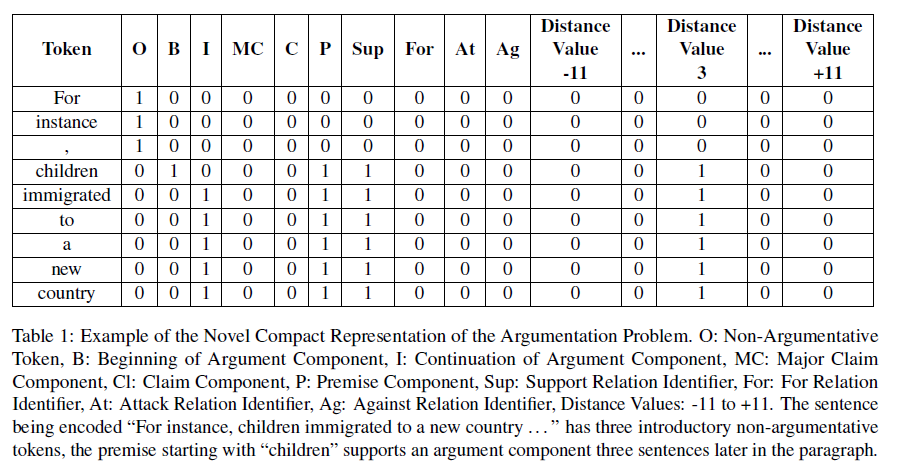
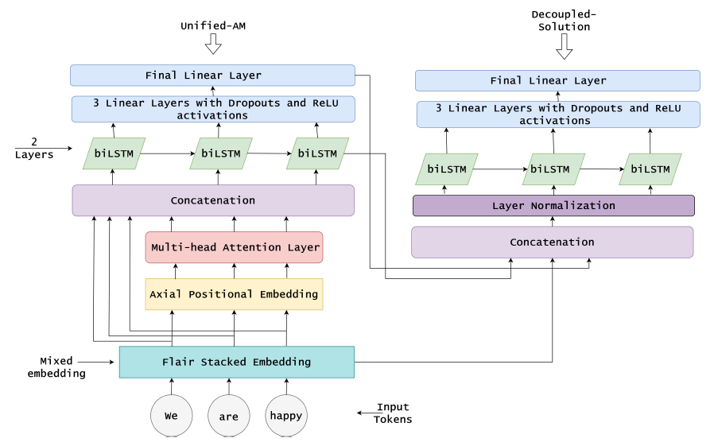

* Paper links
   * ## [A Unified Representation and a Decoupled Deep Learning Architecture for Argumentation Mining of Students' Persuasive Essays (AM_2022_coling2022)](https://aclanthology.org/2022.argmining-1.6/)
   
        We develop a novel unified representation for the argumentation mining task facilitating the extracting from text and the labelling of the non-argumentative units and argumentation components---premises, claims, and major claims---and the argumentative relations---premise to claim or premise in a support or attack relation, and claim to major-claim in a for or against relation---in an end-to-end machine learning pipeline. This tightly integrated representation combines the component and relation identification sub-problems and enables a unitary solution for detecting argumentation structures. This new representation together with a new deep learning architecture composed of a mixed embedding method, a multi-head attention layer, two biLSTM layers, and a final linear layer obtain state-of-the-art accuracy on the Persuasive Essays dataset. Also, we have introduced a decoupled solution to identify the entities and relations first, and on top of that a second model is used to detect distance between the detected related components. An augmentation of the corpus (paragraph version) by including copies of major claims has further increased the performance.  

    * ## [A Unified Representation and Deep Learning Architecture for Argumentation Mining of Students' Persuasive Essays (CMNA22)](http://ceur-ws.org/Vol-3205/paper10.pdf)

        We develop a novel unified representation for the argumentation mining task facilitating the extracting from text and the labelling of the non-argumentative units and argumentation components---premises, claims, and major claims---and the argumentative relations---premise to claim or premise in a support or attack relation, and claim to major-claim in a for or against relation---in an end-to-end machine learning pipeline. This tightly integrated representation combines the component and relation identification sub-problems and enables a unitary solution for detecting argumentation structures. This new representation together with a new deep learning architecture composed of a mixed embedding method, a multi-head attention layer, two biLSTM layers, and a final linear layer obtain state-of-the-art accuracy on the Persuasive Essays dataset. An augmentation of the corpus (Paragraph version) by including copies of major claims has further increased the performance.

* Unified Representation for Argumentation Mining

    

* Model_Architecture (Both Unfied_AM and Decoupled_AM (Unfied_AM + 2nd model to detect distance))

    

* Notes:

    * New augmented corpus are available in the datasets folder.

    * Decoupled_AM model will be available soon.

* To reproduce the results from the papers:
    
    1. Clone the repo: `git clone https://github.com/tawsifsazid/Unified-Representation-for-Argumentation-Mining.git`
    
    2. Create an environment (Python 3.9.7) and run: `pip install -r requirements.txt`
    
    3. Install PyTorch: `conda install pytorch torchvision torchaudio pytorch-cuda=11.6 -c pytorch -c nvidia` or from the [official website]!(https://pytorch.org/get-started/locally/)
    
    4. The weight files can be downloaded from the links. Folder name 'weight' should contain the downloaded files before running the code.

        * [unified_am model weight file for augmented_paragraph corpus](https://mega.nz/file/EDsxEZzI#MMhMdCKZWgtKYOOf-MsSYkuzyyrSWxzEye4ekvKDRWA) 

        
        * [unified_am model weight file for original_essay corpus](https://mega.nz/file/0Wc1xCZL#ESfnk2tJIticQ97eYr_eJ0G1H-eZiMOG0ep8kgrFcK0)

        * [unified_am model weight file for original_paragraph corpus](https://mega.nz/file/BHUkmQhL#HvaqVf5Qs7gLaYm7RS2IY8TUhAOcZa4V8j4q00LUhww)

    5. Run `python main.py` to reproduce the results
    
    6. Default config is set for original essay level corpus. 

* Cite:

    *   @inproceedings{sazid-mercer-2022-unified,
            title = "A Unified Representation and a Decoupled Deep Learning Architecture for Argumentation Mining of Students{'} Persuasive Essays",
            author = "Sazid, Muhammad Tawsif  and
            Mercer, Robert E.",
            booktitle = "Proceedings of the 9th Workshop on Argument Mining",
            month = oct,
            year = "2022",
            address = "Online and in Gyeongju, Republic of Korea",
            publisher = "International Conference on Computational Linguistics",
            url = "https://aclanthology.org/2022.argmining-1.6",
            pages = "74--83",
            abstract = "We develop a novel unified representation for the argumentation mining task facilitating the extracting from text and the labelling of the non-argumentative units and argumentation components{---}premises, claims, and major claims{---}and the argumentative relations{---}premise to claim or premise in a support or attack relation, and claim to major-claim in a for or against relation{---}in an end-to-end machine learning pipeline. This tightly integrated representation combines the component and relation identification sub-problems and enables a unitary solution for detecting argumentation structures. This new representation together with a new deep learning architecture composed of a mixed embedding method, a multi-head attention layer, two biLSTM layers, and a final linear layer obtain state-of-the-art accuracy on the Persuasive Essays dataset. Also, we have introduced a decoupled solution to identify the entities and relations first, and on top of that, a second model is used to detect distance between the detected related components. An augmentation of the corpus (paragraph version) by including copies of major claims has further increased the performance.",
        }

    *   @inproceedings{sazid2022unified,
            title={A unified representation and deep learning architecture for argumentation mining of students’ persuasive essays},
            author={Sazid, Muhammad Tawsif and Mercer, Robert E},
            booktitle={to appear, CEUR Workshop Proceedings},
            year={2022}
        }
